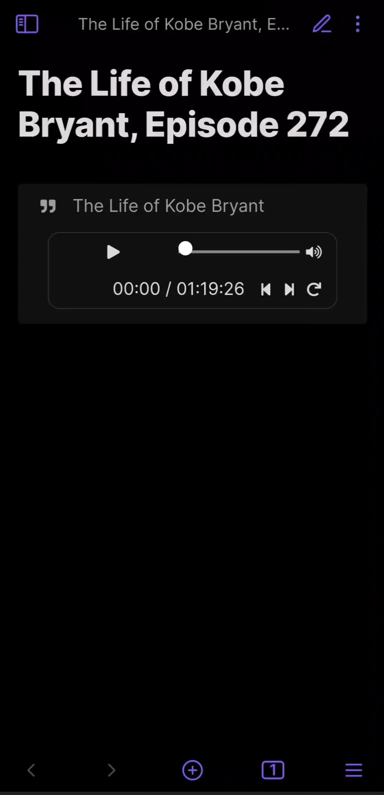
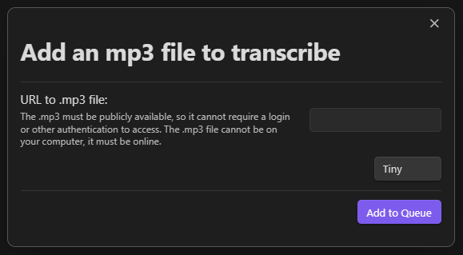
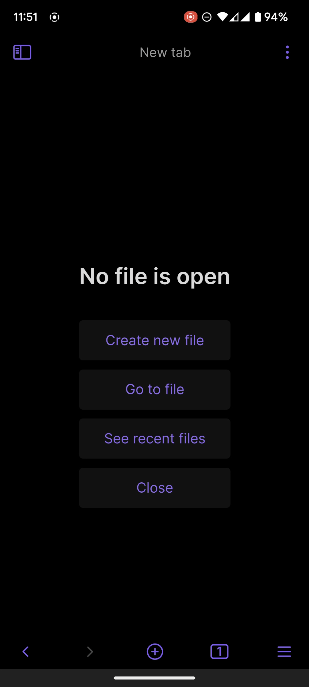

<a href='https://ko-fi.com/jjmaldonis' target='_blank'></a>

# Obsidian Audio Notes

<strong>Audio Notes</strong> is a plugin for the note-taking app Obsidian.

## What are Audio Notes?

<strong>Audio Notes</strong> makes it easy to take notes on audio files as you listen to them.

Check it out!


<strong>Audio Notes</strong> creates a quote callout that contains the quote from the audio and an embedded audio player.

Using the speech recognition software described below, you can generate transcripts for your audio files. Once you have a transcript, <strong>Audio Notes</strong> will automatically generate quotes for your notes!

Audio notes look like this:


To create one, you must specify an audio file and can set a few other attributes. All attributes are set using a callout-like code block:


* `audio`: (required) The audio filename. It can be a local file or a link to an audio file online.
  * (optional) You can add `#t=<start>,<end>` to the end of the filename to set the start and end time of the quote. For example, you can add `t=1:20,1:30` to start the audio segment at 1:20 and end at 1:30. If you do not want to set an end time, you can simply use `t=<start>`.
  * (optional) You can add `&s=<playback-speed>` to the end of the filename, after `#t=<start>,<end>`, to specify the playback rate. If you do not have a start and end time, you can add `#s=<playback-speed>` to the end of the filename. The playback speed defaults to `1.0`.
* `title`: (optional) The title of your note.
* `transcript`: (optional) The filename of the transcript. See below for details.
* `author`: (optional) The text to be used as the author of the quote.

## How to Use the Plugin

Find the .mp3 (or .m4a or .m4b) file you want to take notes on and move it into your vault. You may want to generate a transcript file to allow <strong>Audio Notes</strong> to automatically insert the transcript of the audio (see below).

Once your .mp3 file is in your vault, run the command `Create new Audio Note in new file`. After you select your mp3 file, create a new note is created with an Audio Note that looks like this:

    ```audio-note
    audio: assets/276-paul-grahams-essays-part-2-ads.mp3
    title: Founders Podcast, Episode 276 - Paul Graham's Essays Part 2
    transcript: assets/276-paul-grahams-essays-part-2-ads.json
    ```

Start listening!

When you want to take a note on what was said, pause the audio and run the command `Create new Audio Note at current time (+/- 15 seconds)`. A new audio note will be added at the end of the file, based on the current time of the first audio player in the file.

Edit the newly created audio note to your heart's content! You can change the text and the start/end times of the audio segment. If you extend the audio and need to regenerate the quote to include more words, you can delete the quote then use the command `Regenerate Current Audio Note` or `Regenerate All Audio Notes` to re-create the quote from the start/end times you set.

Now you can listen to your note any time, anywhere :)

#### Bind Hotkeys to Contro Audio Player

If you're on your computer, you can use hotkeys to control the currently-playing audio player. Below are the hotkeys I use:

- `Ctrl + Shift + Right Arrow`: Skip forward
- `Ctrl + Shift + Left Arrow`: Skip backward
- `Ctrl + Shift + Up Arrow`: Speed up
- `Ctrl + Shift + Down Arrow`: Slow down
- `Ctrl + Shift + =`: Reset player to start time
- `Ctrl + Shift + Space`: Toggle play/pause
- `Ctrl + Shift + N`: Create new audio note at current time
- `Ctrl + Shift + G`: Regenerate current audio note

## Using on Mobile

(Only tested on Android)

If you listen to podcasts or other audio files on your phone, being able to take notes on your phone is critical.

The workflow below follows the CODE process by [Tiago Forte](https://fortelabs.com/): Capture, Organize, Distill, and Express. You can quickly capture the information you care about and can come back to it later to organize, distill, and express it without losing your train of though on the podcast/audio you're listening to. This helps to avoid the [Doorway effect](https://en.wikipedia.org/wiki/Doorway_effect#:~:text=The%20doorway%20effect%20is%20a,remained%20in%20the%20same%20place.).

This is the best way I've found to take notes:

1. Install Audio Notes on your phone, and pin the `Create new Audio Note ...` command to the top of your commands (using the core plugin `Command palette`).
2. On your computer preload the .mp3 and transcript, and create a new note in your vault with the initial `audio-note`.
3. Sync your vault to your phone.
4. Open Obsidian on your phone and go for a walk! Listen to the .mp3 from within Obsidian using the `audio-note` you just created and synced to your phone.
5. Pause the audio when you hear something you want to remember, swipe down, and create a new audio note at the end of the note. You can add any personal thoughts at this time below the newly-generated note.
6. When you're done, sync your note back to your computer and edit the quotes.
7. Finish the note by highlighting or summarizing the things you most want to remember.

Here's a video of using <strong>Audio Notes</strong> on your phone.

[](https://audio-notes-public.s3.amazonaws.com/audio-notes-example-mobile.mp4)

## Taking Notes on YouTube Videos

If you're watching a YouTube video with subtitles, you can take notes on it and <strong>Audio Notes</strong> will automatically insert the subtitles into your note.

1. Install the Media Extended plugin.
2. Embed a YouTube video into your note with ``.
3. Run the command `Media Extended: Open Media from Link` and paste the URL of the YouTube video into the box. Start listening.
4. When you're ready to take a note, run the command `Audio Notes: (Media Extended YouTube Video) Create new Audio Note at current time (+/- 15 seconds)` to create a new Audio Note that includes the subtitles of the YouTube video.

(Currently only English is supported)

## Generating a Transcript

There are three ways to generate a transcript: generate it yourself using OpenAI Whisper, generate it automatically, or use an existing .srt file.

### Use an Existing .srt File

If you already have the transcript in .srt format, you can use it directly by putting the filename in the `transcript: <your .srt file>` attribute.

### Generating a Transcript Yourself

This process can be difficult because installing OpenAI Whisper is difficult, but here's how it works:

You can use [OpenAI Whisper](https://github.com/openai/whisper) to generate a transcript from an audio file on your computer. At the time of writing this plugin, OpenAI Whisper is the state-of-the-art speech recognition library.

Running OpenAI Whisper requires Python 3.9. I recommending installing Python 3.9 using [miniconda](https://docs.conda.io/en/latest/miniconda.html). Once python is installed, install OpenAI Whipser with `pip install git+https://github.com/openai/whisper.git`. You may also need to install `ffmpeg`, which is more difficult. See OpenAI Whisper's documentation for more info.

The following python script will perform speech recognition on your audio file and save the transcript to your vault. Once the transript is in your vault, the Audio Notes plugin can use it to generate text automatically.

You can install `tkinter` using `pip install tkinter` to display a "Select File" dialog rather than setting the filename in the code.

```
import whisper
import json


# If tkinter is installed, show a "Select File" dialog.
try:
    import tkinter as tk
    from tkinter.filedialog import askopenfilename
    root = tk.Tk()
    root.withdraw()
    audio_filename = askopenfilename()
    print(f"You selected: {audio_filename}")
except ImportError:
    audio_filename = r"<path-to-audio-file-in-your-vault>.mp3"


# Set the following information to perform speech recognition:
model_name = "small.en"  # See https://github.com/openai/whisper for other options
start: float = None  # (optional) Set to the # of seconds to start at
end: float = None  # (optional) Set to the # of seconds to end at

# Load the audio file and trim it if desired
audio = whisper.load_audio(audio_filename)
samples_per_second = 16_000
if end is not None:
    audio = audio[:int(end * samples_per_second)]
if start is not None:
    audio = audio[int(start * samples_per_second):]

# Load the model. It may be multiple GBs.
model = whisper.load_model(model_name)

# Generate the transcript. This may take a long time.
result = model.transcribe(audio, verbose=False)

# Save the transript to a .json file with the same name as the audio file.
for segment in result["segments"]:
    del segment["id"]
    del segment["seek"]
    del segment["tokens"]
    del segment["temperature"]
    del segment["avg_logprob"]
    del segment["compression_ratio"]
    del segment["no_speech_prob"]
    if start is not None:
        segment["start"] += start
        segment["end"] += start
output_filename = ".".join(audio_filename.split(".")[:-1]) + ".json"
with open(output_filename, "w") as f:
    json.dump(result, f)

print("Done!")
```

### Generating a Transcript Automatically

Automatically generating a transcript makes taking notes on podcasts a breeze. You submit the URL to the podcast's mp3 file, wait 5 minutes for it to process, and start taking notes! It's really that simple.

I'm running a Beta program for new users right now. It has limited access, and there are spots open now.

To use this workflow, you submit a URL to an .mp3 file. The .mp3 file will be processed in the cloud to generate a transcript. After that, the transcript will be used automatically by <strong>Audio Notes</strong> to generate quotes whenever you take a note.

Due to the costs of processing the transcript, I have no choice but to charge for it. I would love to provide it for free, but the costs are non-trivial. As an example, [replicate.com](https://www.replicate.com) charges over $8.00 _per hour!_ for transcribing audio to text with high accuracy. If a podcast is an hour long, that would be $8.00 just to get a highly accurate transcript. I am doing my best to keep costs low, which is why I am running a Beta program.

The pricing below is honestly a fantastic deal.

#### How it Works

For any .mp3 file that is available online, you can transcribe it by using the command `Transcribe mp3 file online`. A dialog window will appear where you can enter the URL of the .mp3 file. Below is the prompt:



You can specify different accuracy levels for the transcription. `Tiny` is the fastest and least accurate transcription level. Each level above `Tiny` increases in both accuracy and cost.

After you submit a URL, it goes into a queue for processing. Once the .mp3 is processed and the transcript is available, you can generate audio notes by setting the `transcript:` field to the .mp3 file's URL. Below is an example using an .mp3 recording of Martin Luther King's famous speech _I Have a Dream_.

	```audio-note
	audio: https://ia800207.us.archive.org/29/items/MLKDream/MLKDream.mp3#t=10
	transcript: https://ia800207.us.archive.org/29/items/MLKDream/MLKDream.mp3
	title: I Have a Dream
	author: Martin Luther King
	```

Note that the `transcript` is set to the mp3's URL.

Here's a video of how it all works:

[](https://audio-notes-public.s3.amazonaws.com/audio-notes-online-transcription-example.mp4)

#### Pricing

I would love to be able to provide this online transcription service for free. Unfortunately, the costs are prohibitive. For example, [replicate.com](https://www.replicate.com) charges over $8.00 _per hour!_ for transcribing audio to text with high accuracy. If a podcast is an hour long, that would be $8.00 just to get a highly accurate transcript. I am doing my best to keep costs low, which is why I am running a Beta program.

Costs scale with accuracy, so the price tiers increase based on the accuracy level you want.

The Tiny tier is a particularly good deal and the transcripts are quite good.

You not only get the transcript, but you also get the note-taking functionality of <strong>Audio Notes</strong>.

* Tiny: $5/month. This is the fastest tier and the transcripts are excellent.
* Base: $15/month. Better accuracy than Tiny, especially when transcribing rare words.
* Small: $30/month. Better accuracy than Base, especially when transcribing names.
* Medium: Currently unavailable due to costs. Contact me if interested.
* Large: Currently unavailable due to costs. Contact me if interested.

#### Email Me to Join

If you would like to join the Beta program, please email me. You can find my email address on my bio page at [github.com/jjmaldonis](https://www.github.com/jjmaldonis). In your email, please include which tier you would like to join at. You can also contact me on Discord by searching for "Audio Notes" in the Obsidian Discord server.

After I have replied to you, you'll be able to subscribe on [Ko-Fi](https://ko-fi.com/jjmaldonis) for the tier you want.

I will then send you an API key to use, and you'll be able to start generating transcripts!

If you are overloading the service, I may ask you to slow down your requests so other people can use the service and get their transcripts quickly.
