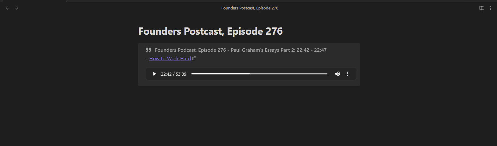

# Obsidian Audio Notes

## Overview

<strong>Audio Notes</strong> is a plugin for the note-taking app Obsidian. It helps you create notes for audio files.

Here an example of an audio note:


Audio notes have a title, the quote in the audio, and an audio player to replay the audio.

Audio notes can be created using an [Admonition](https://github.com/valentine195/obsidian-admonition)-like code block:


The following information can be set:
```audio-note
audio: ...
title: ...
transcript: ...
author: ...
---
<your quote>
```

* `audio`: (required) The audio filename. It can be a local file or a link to an audio file online.
  * You can add `#t=<start>,<end>` to the end of the filename to set the start and end time of the quote. For example, you can add `t=1:20,130`. If you do not want to set an end time, you can simply use `t=1:20`.
* `title`: (optional) The title of your note.
* `transcript`: (optional) The filename of the transcript. See below for details.
* `author`: (optional) The text to be used as the author of the quote.

### The Admonition Plugin is Required for Styling

In order to apply the property styling, you must also have the [Admonition](https://github.com/valentine195/obsidian-admonition) plugin installed.

## Generating Quotes using Automatically

<strong>Audio Notes</strong> can also automatically insert the text in the audio if a transcript for the audio is available (see below).

If you run the command (Ctrl+P) `Generate Audio Notes`, the plugin will find the relevant text in the transcript and automatically insert the text in the note.

The `audio-note` code block will not be overwritten if a quote for the note already exists. This allows you to make any text/formatting updates to the quote without it being overwritten. If you want the quote to be overwritten, delete it before running `Generate Audio Notes`.



You can add an exclamation point `!` to the end of the `audio` filename (after `#t=<start>,<end>`) to automatically adjust the start and end times of the audio to match the generated quote. This can be useful if you don't know the exact start and end times.
## Generating a Transcript

If you have an audio file on your computer, you can use [OpenAI Whisper](https://github.com/openai/whisper) to generate a transcript. At the time of writing this plugin, OpenAI Whisper is the state-of-the-art speech recognition package.

You can easily run OpenAI Whisper using Python 3.9.9. Install it using `pip install git+https://github.com/openai/whisper.git`.

The following python script will perform speech recognition on your audio file and save the transcript to your vault. Once the transript is in your vault, the Audio Notes plugin can use it to generate text automatically.

```
import whisper
import json

model_name = "small.en"  # See https://github.com/openai/whisper for other options
audio_filename = r"<path-to-audio-file-in-your-vault>.mp3"

# Load the model. It may be multiple GBs.
model = whisper.load_model(model_name)

# Generate the transcript. This may take a long time.
result = model.transcribe(audio_filename, verbose=False)

# Save the transript to a .json file with the same name as the audio file.
output_filename = ".".join(audio_filename.split(".")[:-1]) + ".json"
with open(output_filename, "w") as f:
    json.dump(result, f)

print("Done!")
```
