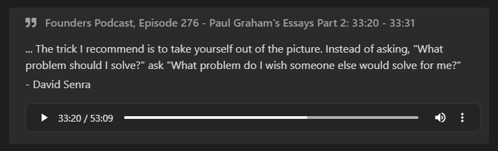
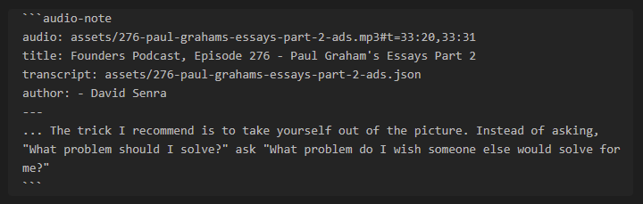

<a href='https://ko-fi.com/jjmaldonis' target='_blank'>

# Obsidian Audio Notes

<strong>Audio Notes</strong> is a plugin for the note-taking app Obsidian.

In order to apply the property styling for audio notes, you must have the [Admonition](https://github.com/valentine195/obsidian-admonition) plugin installed.

## What are Audio Notes?

<strong>Audio Notes</strong> makes it easy to take notes on audio files as you listen to them.

Check it out!


<strong>Audio Notes</strong> creates a quote callout that contains the quote from the audio and an embedded audio player.

If you use the speech recognition software described below, you can generate transcripts for your audio files. Once you have a transcript, <strong>Audio Notes</strong> will automatically generate quotes for your notes!

Audio notes look like this:


To create one, you must specify an audio file and may set a few other attributes. All attributes are set using an Admonition-like code block (thanks [Admonition](https://github.com/valentine195/obsidian-admonition)!):


* `audio`: (required) The audio filename. It can be a local file or a link to an audio file online.
  * (optional) You can add `#t=<start>,<end>` to the end of the filename to set the start and end time of the quote. For example, you can add `t=1:20,1:30` to start the audio segment at 1:20 and end at 1:30. If you do not want to set an end time, you can simply use `t=<start>`.
* `title`: (optional) The title of your note.
* `transcript`: (optional) The filename of the transcript. See below for details.
* `author`: (optional) The text to be used as the author of the quote.

## How to Use the Plugin

Find the .mp3 file you want to take notes on and move it into your vault. You may want to generate a transcript using the Python code at the end of this README to allow <strong>Audio Notes</strong> to automatically insert the transcript of the audio.

Once your .mp3 file is in your vault, create a new note and create an Audio Note by writing an Admonition-like code block. Here is an example:

    ```audio-note
    audio: assets/276-paul-grahams-essays-part-2-ads.mp3
    title: Founders Podcast, Episode 276 - Paul Graham's Essays Part 2
    transcript: assets/276-paul-grahams-essays-part-2-ads.json
    ```

Start listening!

When you want to take a note on what was said, pause the audio and run the command `Create new Audio Note at current time (+/- 15 seconds)`. A new audio note will be added at the end of the file, based on the current time of the first audio player in the file.

Edit the newly created audio note to your heart's content! You can change the text and the start/end times of the audio segment. If you extend the audio and need to regenerate the quote to include more words, you can delete the quote then use the command `Regenerate Current Audio Note` or `Regenerate All Audio Notes` to re-create the quote from the start/end times you set.

Listen to your note any time, anywhere :)

## Generating a Transcript

If you have an audio file on your computer, you can use [OpenAI Whisper](https://github.com/openai/whisper) to generate a transcript. At the time of writing this plugin, OpenAI Whisper is the state-of-the-art speech recognition library.

You can easily run OpenAI Whisper using Python 3.9. First install Python 3.9 (I recommend using [miniconda](https://docs.conda.io/en/latest/miniconda.html)), then install OpenAI Whipser with `pip install git+https://github.com/openai/whisper.git`.

The following python script will perform speech recognition on your audio file and save the transcript to your vault. Once the transript is in your vault, the Audio Notes plugin can use it to generate text automatically.

You can install `tkinter` using `pip install tkinter` to display a "Select File" dialog rather than setting the filename in the code.

```
import whisper
import json


# If tkinter is installed, show a "Select File" dialog.
try:
    import tkinter as tk
    from tkinter.filedialog import askopenfilename
    root = tk.Tk()
    root.withdraw()
    audio_filename = askopenfilename()
    print(f"You selected: {audio_filename}")
except ImportError:
    audio_filename = r"<path-to-audio-file-in-your-vault>.mp3"


# Set the following information to perform speech recognition:
model_name = "small.en"  # See https://github.com/openai/whisper for other options
start: float = None  # (optional) Set to the # of seconds to start at
end: float = None  # (optional) Set to the # of seconds to end at

# Load the audio file and trim it if desired
audio = whisper.load_audio(audio_filename)
samples_per_second = 16_000
if end is not None:
    audio = audio[:int(end * samples_per_second)]
if start is not None:
    audio = audio[int(start * samples_per_second):]

# Load the model. It may be multiple GBs.
model = whisper.load_model(model_name)

# Generate the transcript. This may take a long time.
result = model.transcribe(audio, verbose=False)

# Save the transript to a .json file with the same name as the audio file.
for segment in result["segments"]:
    del segment["id"]
    del segment["seek"]
    del segment["tokens"]
    del segment["temperature"]
    del segment["avg_logprob"]
    del segment["compression_ratio"]
    del segment["no_speech_prob"]
    if start is not None:
        segment["start"] += start
        segment["end"] += start
output_filename = ".".join(audio_filename.split(".")[:-1]) + ".json"
with open(output_filename, "w") as f:
    json.dump(result, f)

print("Done!")
```
